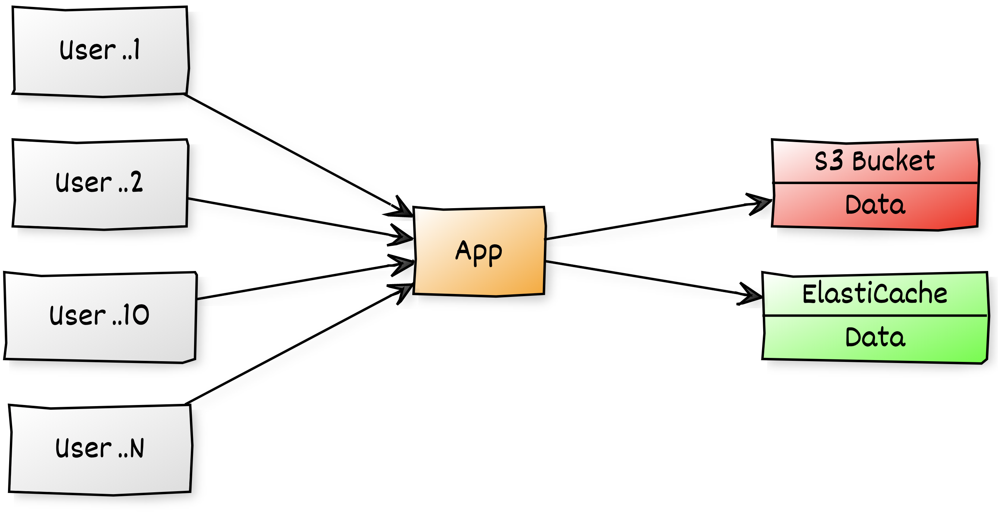
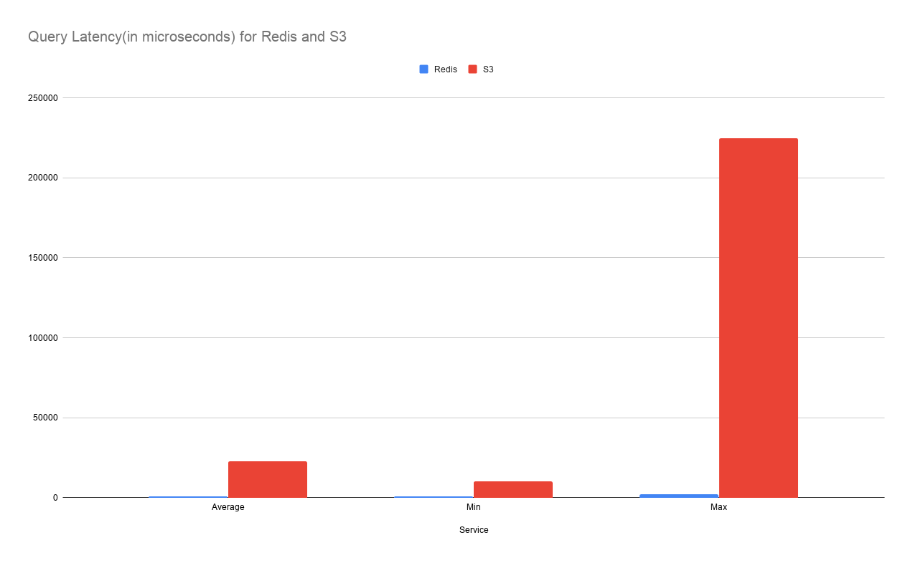

# Use ElastiCache to improve Application Performance

Many applications use S3 as the backend for storing data like images, videos, files etc., As your user base grows and you start reaching millions of requests to these objects, Latency and Costs play an important role in maintaining application performance. Especially if your application requires <5 ms responses. For such applications, customers can complement S3 with an in-memory cache like ElastiCache for Redis. It reduces S3 retrieval costs and improves application performance.

  

Here, let me show, how you can set up an in-memory cache using ElastiCache for Redis, along with best practices to be used with S3. You can also test the performance benefits of incorporating a cache for S3. All the necessary code is written in Cloudformation using CDK.

  Follow this article in **[Youtube](https://www.youtube.com/c/ValaxyTechnologies)**

1. ## 🧰 Prerequisites

    This demo, instructions, scripts and cloudformation template is designed to be run in `us-east-1`. With few modifications you can try it out in other regions as well(_Not covered here_).

    - AWS CLI pre-configured - [Get help here](https://youtu.be/TPyyfmQte0U)
    - AWS CDK Installed & Configured - [Get help here](https://www.youtube.com/watch?v=MKwxpszw0Rc)
    - Python Packages, _Change the below commands to suit your OS_
        - Python3 - `yum install -y python3`
        - Python Pip - `yum install -y python-pip`
        - Virtualenv - `pip3 install virtualenv`

1. ## ⚙️ Setting up the environment

    - Get the application code

        ```bash
        git clone https://github.com/miztiik/elasticache-for-app-performance.git
        cd elasticache-for-app-performance
        ```

1. ## 🚀 Resource Deployment using AWS CDK

    The cdk stack provided in the repo will create the following resources,
    - VPC with public & private subnets, route table for private subnet
    - NAT Gateway x 1 for private subnet to communicate with the internet
    - AWS ElastiCache inside private subnet
    - S3 Bucket
    - Lambda - To ingest dummy test data into _S3_ & _AWS ElastiCache_
    - EC2 Instance in public subnet: We will use this instances to simulate a application client querying _S3_ or _AWS ElastiCache_

    **Note**: _Most of the resources should be covered under the aws free tier, except the NAT Gateway. You can swap it out for a NAT Instance_

    If you have AWS CDK installed you can close this repository and deploy the stack with,

    ```bash
    # If you DONT have cdk installed
    npm install -g aws-cdk

    # Make sure you in root directory
    cd elasticache-for-app-performance
    python3 -m venv .env
    source .env/bin/activate
    pip install -r requirements.txt
    ```

    The very first time you deploy an AWS CDK app into an environment _(account/region)_, you’ll need to install a `bootstrap stack`, Otherwise just go aheadand   deploy using `cdk deploy`

    ```bash
    cdk bootstrap
    cdk deploy
    ```

1. ## 🔬 Testing the solution

    Your ElastiCache Redis cluster is pre-loaded with a total of 200 files as a _set_. The same data is stored in your S3 bucket. The size of these files are slighly randomized with random string content. _To know more check out the `redis_data_ingester_lambda_function`._

    - In the _Outputs_ section of the Clouformation template/service, Make a note of the following paramets, we will use them later
        - `Redis Host` domain name - This cache cluster is pre-loaded with data for querying
        - `Redis Port`
        - `S3 Bucket Name` - This bucket is pre-loaded with data for querying
        - `EC2 Instance` - This server will be used to connect/query S3 and Redis
    - Connect to the EC2 instance using Session Manager - [Get help here](https://www.youtube.com/watch?v=-ASMtZBrx-k)
    - Clone this repo, We need the `helper_scripts` in this repo

        ```bash
        git clone https://github.com/miztiik/elasticache-for-app-performance.git
        cd elasticache-for-app-performance
        cd helper_scripts
        ```

    - Edit the file `redis_stack_configs.py` with the values from your clouformation outputs.
    - Fetch data from **Redis**:

        ```bash
        python3 query_redis.py
        ```

    - Fetch data from **S3**:

        ```bash
        python3 query_s3.py
        ```

    - Sample results from my test,

        ```bash
        # Redis Query Results
        Average Latency in Microseconds: 683.2525252525253
        MAX Latency in Microseconds: 1890
        MIN Latency in Microseconds: 606

        # S3 Query Results
        Average Latency in Microseconds: 22621.565656565657
        MAX Latency in Microseconds: 224836
        MIN Latency in Microseconds: 10334
        ```

    - Compare the data retrieval times for both these queries. Here is a graph that i made with the data froom the results.

    

    You will notice that the queries against ElastiCache Redis were significantly quicker than the queries against S3.

1. ## 🧹 CleanUp

    If you want to destroy all the resources created by the stack, Execute the below command to delete the stack, or _you can delete the stack from console as well_

    - Resources created during [deployment](#🚀-resource-deployment-using-aws-cdk)
    - Delete CloudWatch Lambda LogGroups
    - _Any other custom resources, you have created for this demo_

    ```bash
    # Delete from cdk
    cdk destroy

    # Delete the CF Stack, If you used cloudformation to deploy the stack.
    aws cloudformation delete-stack \
        --stack-name "MiztiikAutomationStack" \
        --region "${AWS_REGION}"
    ```

    This is not an exhaustive list, please carry out other necessary steps as maybe applicable to your needs.

## 👋 Buy me a coffee

[Buy me](https://paypal.me/valaxy) a coffee ☕, _or_ You can reach out to get more details through [here](https://youtube.com/c/valaxytechnologies/about).

### 📚 References

1. [Install NPM](https://docs.aws.amazon.com/sdk-for-javascript/v2/developer-guide/setting-up-node-on-ec2-instance.html)

1. [Python Pip Redis](https://pypi.org/project/redis/)
1. [AWS Blog](https://aws.amazon.com/blogs/storage/turbocharge-amazon-s3-with-amazon-elasticache-for-redis)
1. [AWS Blog: Latency Reduction](https://aws.amazon.com/blogs/database/latency-reduction-of-hybrid-architectures-with-amazon-elasticache)

### 🏷️ Metadata

**Level**: 400
